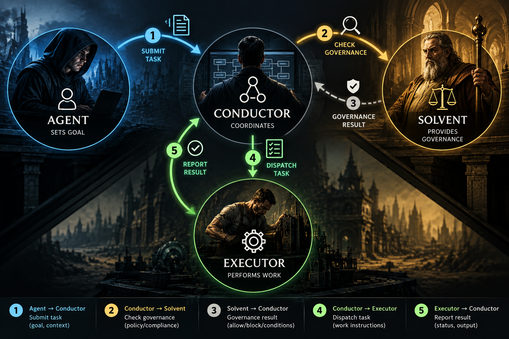

# Conductor

Conductor is a lightweight coordination system for autonomous and AI-driven
work. It tracks projects, tasks, dependencies, and assignments so that agents
and humans can coordinate without stepping on each other. Conductor decides
*who is doing what* — it does not decide *what is true* or *what should
happen*. Those questions belong to the agents and the external systems they
use.

## Core model



Four roles, each with a distinct responsibility:

| Role | Name | Responsibility |
|------|------|---------------|
| Agency | **Agent** | Reasons, implements, produces artifacts, performs work |
| Coordination | **Conductor** | Tracks work, assignments, dependencies, lifecycle |
| Authority | **[Solvent](https://github.com/PithomLabs/solvent)** | Owns authorization and consequential decisions |
| Effect | **Executor** | Produces actual external outcomes |

A single rule binds them: **capability ≠ work ≠ authority ≠ execution**.
Conductor enforces this by never executing work, never authorizing
consequences, and never inferring authority from task state.


## What Conductor provides

- **Projects** — top-level containers for related work
- **Tasks** — units of work with a typical lifecycle (proposed → active →
  review → accepted)
- **Dependencies** — blocking relationships between tasks
- **Assignment** — atomic claim/release so only one agent works a task at a
  time
- **Activity history** — append-only log of every state transition and agent
  action
- **HTTP API** — authenticated REST interface under `/v1/`
- **MCP interface** — stdio JSON-RPC for agent integration
- **Web UI** — minimal Kanban board and task detail view
- **Governance observation** — read-only view of external authorization
  state (e.g., Solvent belief status)

## Typical workflow

```
discover available tasks  →  claim a task  →  perform work
                                                    ↓
                                            record activity
                                                    ↓
                                            submit for review
                                                    ↓
                                          review  →  accept
```

Tasks can also be blocked by dependencies on other tasks. A task's dependency
must be resolved before the blocked task becomes available for claiming.

## What Conductor is NOT

- **Not an AI reasoning engine.** Conductor does not think, hypothesize, or
  evaluate domain propositions.
- **Not a domain knowledge system.** Conductor has no opinion about physics,
  software architecture, cybersecurity, or any other domain.
- **Not an authorization engine.** Conductor authenticates callers but never
  authorizes consequences. That responsibility belongs to Solvent.
- **Not an execution system.** Conductor coordinates work; actual execution
  happens externally.

## Quick start

**Prerequisites:** Go 1.25+ and [Task](https://taskfile.dev/) (optional but
recommended).

```bash
# Build
task build          # or: go build -o bin/conductor ./cmd/conductor

# Test
task test           # or: go test ./...

# Lint
task lint           # or: go vet ./...

# Run — API mode (requires credentials)
CONDUCTOR_API_KEY="mykey:myagent" ./bin/conductor --mode api

# Run — MCP mode (stdio, for agent integration)
./bin/conductor --mode mcp

# Run — Web UI (binds to 127.0.0.1:8080)
./bin/conductor --mode web
```

**Flags:**

| Flag | Default | Description |
|------|---------|-------------|
| `--mode` | `api` | `api`, `mcp`, or `web` |
| `--addr` | `:8080` | HTTP listen address |
| `--db` | `conductor.db` | SQLite database path |

**Environment variables:**

| Variable | Required for | Description |
|----------|-------------|-------------|
| `CONDUCTOR_API_KEY` | api | Credentials as `key1:actor-1,key2:actor-2` |
| `CONDUCTOR_MCP_AGENT_ID` | mcp | Agent identity (default: `agent-mcp`) |
| `SOLVENT_URL` | optional | Solvent API URL for governance integration |
| `SOLVENT_API_KEY` | optional | Solvent API key |

## Repository layout

```
cmd/conductor/       Entry point (api, mcp, web modes)
internal/
  domain/            Core types: Project, Task, Activity, Dependency
  store/             SQLite persistence, lifecycle enforcement, error types
  api/               HTTP API handlers and authentication
  mcp/               MCP stdio server and tool implementations
  web/               Minimal web UI (HTML templates)
  governance/        GovernanceReader interface and types
```

## Documentation

[**AGENTS.md**](AGENTS.md) is the engineering source of truth. It covers:

- Architecture and invariants
- Lifecycle semantics and data model
- API and MCP surfaces
- Security and authentication rules
- Database and transaction rules
- Adapter and integration patterns
- Testing expectations
- Architectural growth gate
- Anti-patterns and definition of done

For contribution and development guidance, start with AGENTS.md sections 22
and 18.

## License

MIT
